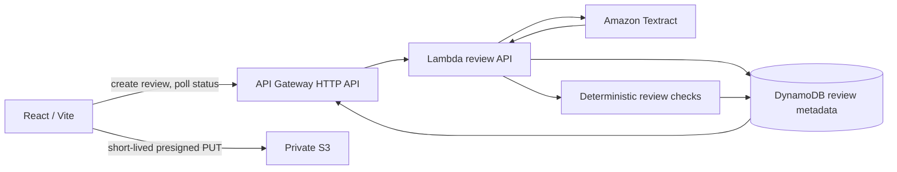

# Architecture

ReadyToSubmit keeps its React/Vite user experience and adds a small serverless review path for personal documents.

## Upload and review flow

1. The browser asks the API to create an opaque UUID review session.
2. The API returns a browser-held capability token and short-lived, encrypted S3 upload URL only after validating type, MIME type and platform size limit.
3. The browser uploads directly to the private bucket; Lambda verifies the object before starting asynchronous Textract `StartDocumentAnalysis` with `FORMS` and document-specific `QUERIES`.
4. The browser polls `GET /reviews/{reviewId}`. Lambda reads `GetDocumentAnalysis`, stores field candidates and Textract page/bounding-box evidence, then applies deterministic missing-document, name-consistency and roll-number checks.
5. A replacement simply receives a new S3 key and Textract job; it becomes the document’s active version when processing succeeds.

The 24-hour object lifecycle intentionally limits demo retention. Sample Mode never calls AWS.

## Why deterministic checks

Textract helps read fields; it does not decide an outcome. The review engine produces only preparation findings such as “check name difference” or “confirm this roll number.” It never makes eligibility, authenticity, fraud, acceptance or submission decisions.
